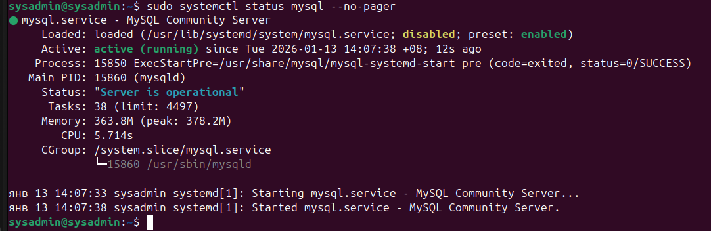
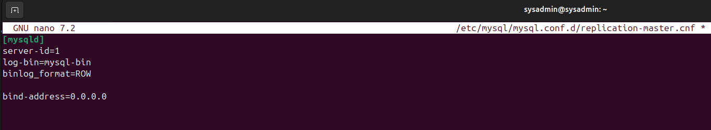
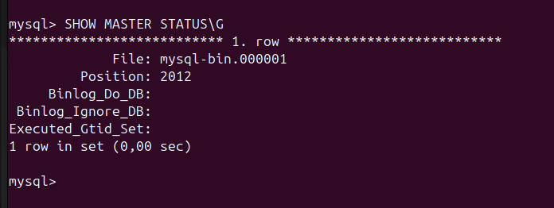

# Домашнее задание к занятию "`Репликация и масштабирование. Часть 1`" - `Oleg Avvakumov`

---

### Задание 1
'На лекции рассматривались режимы репликации master-slave, master-master, опишите их различия.
Ответить в свободной форме.'

### Ответ

`На лекции разбирали два основных варианта репликации: master–slave и master–master. Суть репликации вообще — чтобы данные с одного сервера базы данных копировались на другой (или другие). Это нужно для устойчивости и/или чтобы разгрузить базу.

Важно помнить: репликация — это не бэкап. Если на мастере кто-то удалил данные, то это удаление так же разъедется на реплики.
1) Master–Slave (ведущий–ведомый)
Как устроено:
Master — главный сервер. Все записи (INSERT/UPDATE/DELETE) делаем только туда.
Slave — “копия мастера”, которая постоянно догоняет его по изменениям. Обычно со slave делают чтение (SELECT).

Как это работает по логике:
Мастер записывает изменения (условно: “журнал изменений”), slave этот журнал забирает и повторяет у себя те же изменения. Поэтому slave становится почти такой же, как master (иногда с небольшим отставанием).

Зачем так делают:
Если запросов на чтение много, можно часть чтения отправлять на slave — master меньше нагружается.
Можно сделать несколько slave и масштабировать чтение “горизонтально”.

Минусы/ограничения:
Запись всё равно упирается в один master — это узкое место.
Возможна задержка: записали на master, а slave ещё не успел обновиться → можно прочитать “старые” данные.
Если master падает — нужно переключение (failover): назначить новый master и перенастроить приложение.
2) Master–Master (двусторонняя репликация)
Как устроено:
Тут оба сервера — мастера.
Можно писать в любой: и первый, и второй принимают записи.
Потом они обмениваются изменениями и синхронизируются друг с другом.
Зачем так делают:
Выше отказоустойчивость: если один сервер умер — второй продолжает работать.
Иногда так пытаются распределять нагрузку (включая запись).
Главная проблема:
Этот режим сложнее, потому что когда пишем в два места, появляются конфликты:
Например, на первом мастере поменяли одну и ту же запись так, а на втором — иначе.
Плюс есть вопросы с уникальными ключами и автоинкрементом (чтобы два мастера случайно не выдали одинаковый ID).
Поэтому master–master обычно требует строгих правил: кто и что пишет, или дополнительной логики разрешения конфликтов.

 Итоговое сравнение:

Master–Slave
-Запись: только в master
-Чтение: часто со slave
-Плюс: проще и понятнее, отлично разгружает чтение
-Минус: один узел на запись, возможны задержки и нужен механизм переключения при падении master

Master–Master
-Запись: в любой из двух master
-Чтение: тоже с любого
-Плюс: выше доступность (один упал — второй работает)
-Минус: сложнее, возможны конфликты и нужно продумывать уникальность/согласованность данных`

---

### Задание 2
'Задание 2
Выполните конфигурацию master-slave репликации, примером можно пользоваться из лекции.
Приложите скриншоты конфигурации, выполнения работы: состояния и режимы работы серверов.'

### Ответ

`master'

`master'

`master'

`master'

`slave'

`slave'

`slave'

`slave'

---

